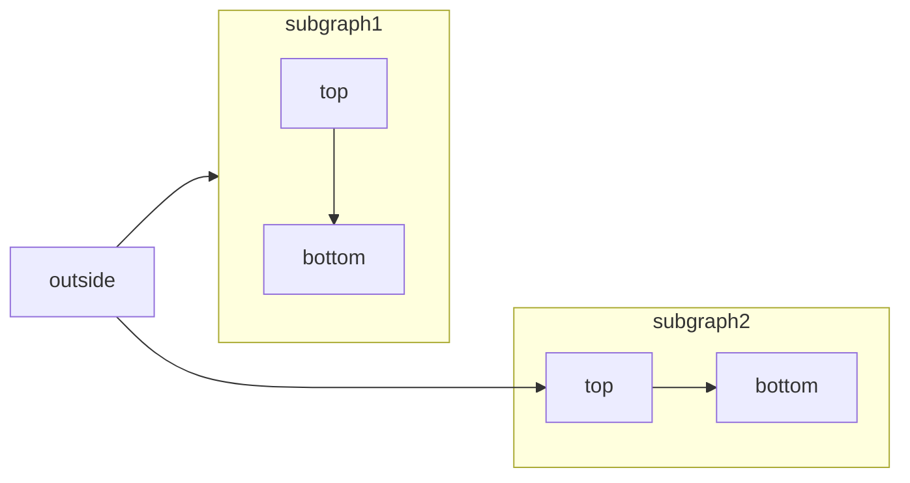

---
title: "Add/delete Users"
---

<Icon icon="user-tie" iconType="solid" /> Manager | <Icon icon="handshake" iconType="solid" /> Partner

*Partner* or *Manager* of your account can easily manage users within Taikun. Here’s how new User profiles can be created and deleted.

## Add Users

<Icon icon="user-tie" iconType="solid" /> Manager | <Icon icon="handshake" iconType="solid" /> Partner

To add a user to your account, look for the button “*Add User*” in the upper-right corner of the *Users* section. You’ll need to provide the new user’s 1) User name 2) Display name (optional) 3) email addresses. Additionally,  you can specify the user’s Organization (available to *Partner*) and Role (available to *Partner* and *Manager*). Hit the “+ Add” button to create a new profile.

<Frame caption="Add Users">
  
</Frame>

## Delete Users

<Icon icon="user-tie" iconType="solid" /> Manager | <Icon icon="handshake" iconType="solid" /> Partner

To delete a user from your account, locate the user in the *Users* section and look for the option “*Delete*“.  You need to confirm your action before a profile gets deleted. 

<Frame caption="Delete Users">
  
</Frame>

---
title: "Introduction"
description: "Welcome to the home of your new documentation"
---

## Setting up

The first step to world-class documentation is setting up your editing environments.

<CardGroup cols={2}>
  <Card title="Edit Your Docs" icon="pen-to-square" href="https://mintlify.com/docs/quickstart">
    Get your docs set up locally for easy development
  </Card>

  <Card title="Preview Changes" icon="image" href="https://mintlify.com/docs/development">
    Preview your changes before you push to make sure they're perfect
  </Card>
</CardGroup>

## Make it yours

Update your docs to your brand and add valuable content for the best user conversion.

<CardGroup cols={2}>
  <Card title="Customize Style" icon="palette" href="https://mintlify.com/docs/settings/global">
    Customize your docs to your company's colors and brands
  </Card>

  <Card title="Reference APIs" icon="code" href="https://mintlify.com/docs/api-playground/openapi">
    Automatically generate endpoints from an OpenAPI spec
  </Card>

  <Card title="Add Components" icon="screwdriver-wrench" href="https://mintlify.com/docs/components/accordion">
    Build interactive features and designs to guide your users
  </Card>

  <Card title="Get Inspiration" icon="stars" href="https://mintlify.com/customers">
    Check out our showcase of our favorite documentation
  </Card>
</CardGroup>

